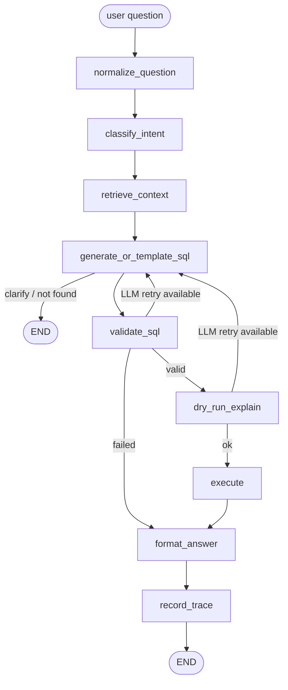

# Furniture Natural-Language Query Tool

A small terminal tool that lets you ask plain-English questions about a furniture inventory. It translates questions into read-only SQL, validates the SQL with an application guard, runs it against a SQLite database opened in read-only mode, and replies in natural language or with deterministic formatting for common aggregate questions.

## Setup

Package management is via [uv](https://docs.astral.sh/uv/).

```bash
uv sync
cp .env.example .env   # then add your OPENROUTER_API_KEY for non-template questions
uv run python db/seed.py
uv run python chat.py
```

## How it works

Each turn runs through an explicit LangGraph pipeline:

1. **normalize_question** - lowercases, trims, and applies business synonyms such as sofa -> couch.
2. **classify_intent** - checks in-process query memory and routes common count, value, list, and location questions to approved templates.
3. **retrieve_context** - builds compact semantic context from table/column descriptions, joins, catalog values, and value samples.
4. **generate_or_template_sql** - uses deterministic SQL templates when possible; otherwise asks the LLM for a typed JSON action.
5. **validate_sql** - `sqlglot` rejects unsafe SQL before execution: non-SELECT statements, multiple statements, comments, `SELECT *`, schema probing, unknown tables/columns/functions, recursive CTEs, and row-returning queries without `LIMIT`.
6. **dry_run_explain** - runs `EXPLAIN QUERY PLAN` against the read-only SQLite connector.
7. **execute** - runs the validated query through the connector with read-only mode, max rows, and a SQLite progress handler.
8. **format_answer** - formats template results deterministically; LLM-generated SQL still uses a separate answer-composition LLM call.
9. **record_trace** - stores approved question/SQL/result-shape metadata in process memory for reuse during the session.

The safety model remains two-layered: AST validation in `pipeline/sql_guard.py` plus SQLite opened with `mode=ro` in `pipeline/db.py`.



## Tests

```bash
uv run python db/seed.py
uv run python tests/test_sql_guard.py
uv run python tests/test_pipeline_templates.py
```

Manual scenarios live in `tests/test_manual.md`.
