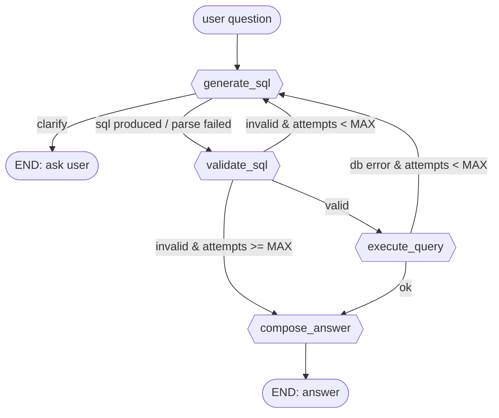

# Furniture Natural-Language Query Tool

A small, self-contained terminal tool that lets you ask plain-English questions about a
company's furniture inventory. It translates the question into a read-only SQL query,
validates it for safety, runs it against a SQLite database, and replies in natural
language. When a question is genuinely ambiguous, it asks a clarifying question instead
of guessing.

## Setup

Package management is via [uv](https://docs.astral.sh/uv/).

```bash
uv sync
cp .env.example .env   # then add your OPENROUTER_API_KEY
uv run python db/seed.py
uv run python chat.py
```

## How it works

Each turn runs through a LangGraph pipeline:

1. **generate_sql** — the LLM converts the question (plus any prior clarify round-trip)
   into a single read-only SELECT statement, or asks a clarifying question.
2. **validate_sql** — `sqlglot` parses the SQL and rejects anything that isn't a single
   SELECT over known tables/columns with no dangerous functions. Failures are fed back
   to the LLM for a bounded number of retries (`MAX_ATTEMPTS = 2`).
3. **execute_query** — the validated SQL runs against a SQLite connection opened in
   true read-only mode (`mode=ro`), a second independent safety layer beneath the
   validator.
4. **compose_answer** — a separate LLM call, given only the question and result rows
   (never SQL-generation ability), writes the final natural-language answer.

Generated SQL is printed to the console (dimmed, via `rich`) for debugging but never
surfaced to the user as part of the answer.


