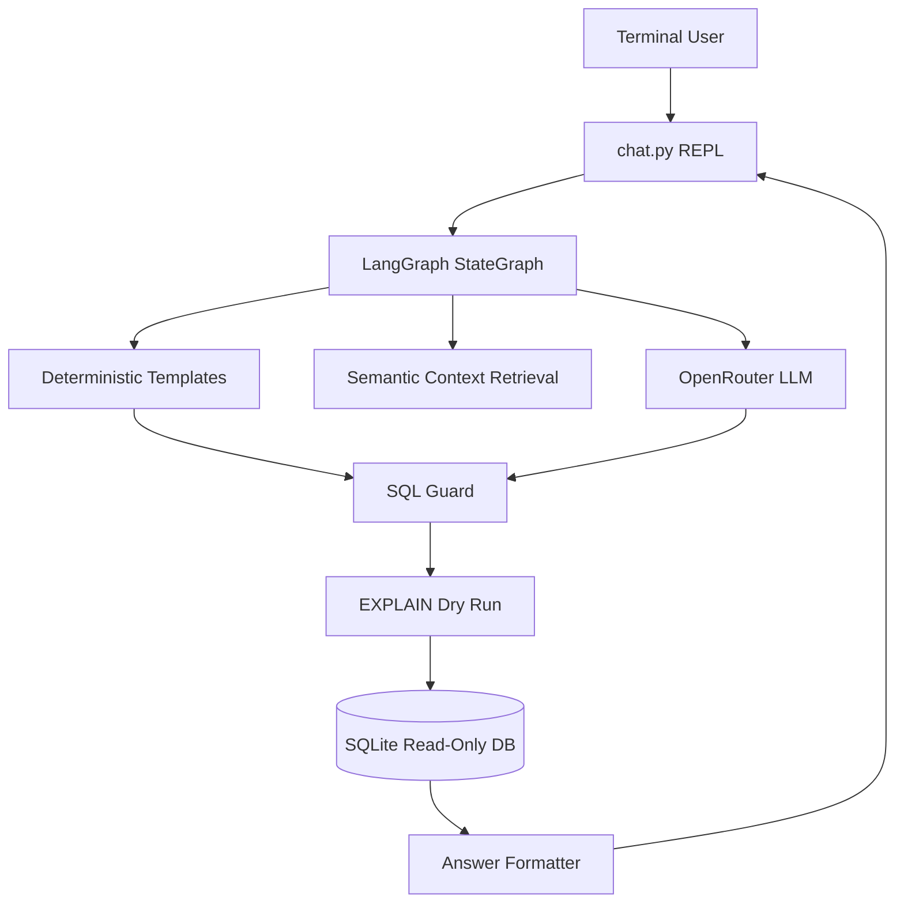
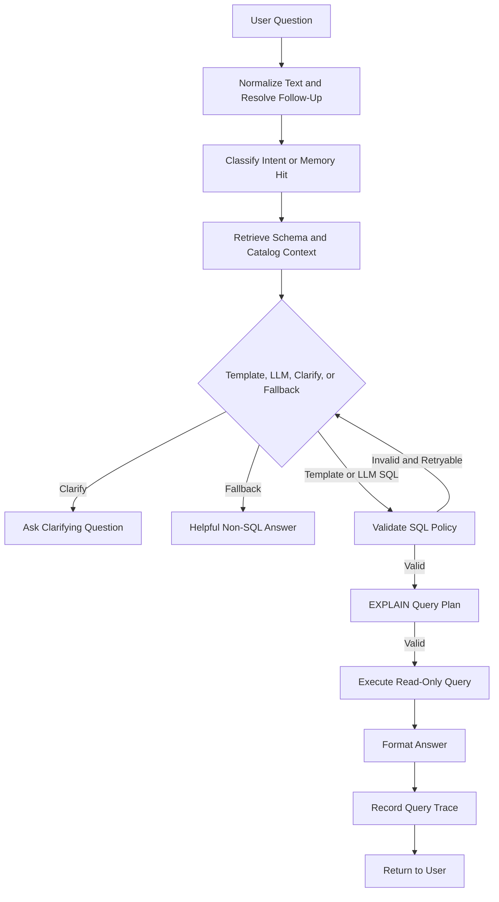

# Slide 1
Project Overview

Goal:
Present a terminal-based natural-language query assistant that lets business users ask inventory questions without writing SQL.

Key Points:
- Converts plain-English furniture inventory questions into safe read-only SQL.
- Uses deterministic templates for common questions and an LLM fallback for flexible queries.
- Targets operators, managers, or analysts who need quick answers from a small structured database.

Speaker Notes:
This project demonstrates how to wrap an LLM in conventional engineering controls so a user gets useful database answers without exposing the database to arbitrary model output.

Visual Suggestion:
Screenshot of the terminal REPL showing a question, answer, and concise inventory result.

# Slide 2
Problem Statement

Goal:
Explain why natural-language access to operational data needs both usability and safety.

Key Points:
- Non-technical users often need database answers but cannot reliably write SQL.
- Raw LLM-to-SQL systems can produce invalid, unsafe, or overly broad queries.
- The project is valuable because it combines natural-language convenience with strict validation and read-only execution.

Speaker Notes:
The core problem is not just generating SQL. The hard part is making generated SQL trustworthy enough to run, handling ambiguity, and producing business-readable answers.

Visual Suggestion:
Two-column table: "Naive LLM SQL" vs. "Guarded Query Pipeline".

# Slide 3
System Architecture

Goal:
Show the major system boundaries and how responsibility is separated.

Key Points:
- `chat.py` owns the terminal interaction and conversation history.
- `pipeline/graph.py` defines the LangGraph state machine.
- `pipeline/nodes.py` implements normalization, routing, generation, validation, execution, and answer formatting.
- `pipeline/sql_guard.py` and `pipeline/db.py` form independent safety layers.
- SQLite stores inventory data; OpenRouter-backed LLM calls are used only where needed.



Speaker Notes:
The architecture keeps model behavior behind a controlled graph. Each module has a narrow responsibility:
- Terminal User: asks business questions in plain English.
- `chat.py` REPL: captures input, preserves conversation history, and displays answers or clarifying questions.
- LangGraph StateGraph: coordinates the workflow, state transitions, retries, and terminal routing decisions.
- Deterministic Templates: handles high-confidence common inventory questions without an LLM call.
- Semantic Context Retrieval: supplies schema, joins, synonyms, and catalog values so LLM generation is grounded.
- OpenRouter LLM: produces structured SQL-generation actions only for questions outside the template path.
- SQL Guard: parses and validates SQL policy before any database execution is allowed.
- EXPLAIN Dry Run: asks SQLite to plan the query first, catching execution issues before running it.
- SQLite Read-Only DB: stores inventory data and enforces the second safety layer with read-only connections.
- Answer Formatter: turns result rows into short business-readable answers without exposing SQL mechanics.

Visual Suggestion:
Architecture diagram from the Mermaid graph.

# Slide 4
Project Structure

Goal:
Explain how the repository organization supports clarity and maintainability.

Key Points:
- Application logic is isolated in `pipeline/`.
- Database schema and seed data are isolated in `db/`.
- Tests focus on SQL safety and deterministic pipeline behavior.
- Docs capture the original build plan, manual scenarios, and presentation material.

```text
semantic-sql/
|-- chat.py                  # terminal entry point
|-- db/
|   |-- schema.sql           # inventory schema
|   `-- seed.py              # reproducible SQLite seed data
|-- pipeline/
|   |-- graph.py             # LangGraph orchestration
|   |-- nodes.py             # pipeline node behavior
|   |-- templates.py         # deterministic intent-to-SQL paths
|   |-- sql_guard.py         # sqlglot policy validation
|   |-- db.py                # read-only SQLite access
|   |-- retrieval.py         # compact schema/context retrieval
|   `-- prompts.py           # centralized LLM prompts
|-- tests/                   # executable safety and behavior checks
`-- docs/                    # plan, manual tests, presentation
```

Speaker Notes:
The structure is intentionally small. Each layer has a narrow job, which makes it easier to reason about failure modes and evolve the project without hidden coupling.

Visual Suggestion:
Repository tree with callouts for orchestration, safety, and data.

# Slide 5
End-to-End Pipeline

Goal:
Show how a user question becomes a safe answer.

Key Points:
- Questions are normalized and enriched with known catalog values.
- Common intents route to approved SQL templates before using the LLM.
- LLM-generated SQL is parsed as JSON, validated, dry-run with `EXPLAIN`, and executed read-only.
- Errors can retry LLM SQL generation up to a bounded maximum; ambiguous questions clarify instead of guessing.



Speaker Notes:
The pipeline starts when the user enters a plain-English inventory question in the terminal. The system first normalizes the text by trimming whitespace, lowercasing, applying business synonyms, and resolving simple follow-up references such as "they" or "one" against recent conversation history. Next, it classifies the intent: if the request matches a known inventory pattern, such as quantity, price, value, location, or category list, the system uses a deterministic SQL template; if the request is vague, it asks a clarifying question; if it is outside the product domain, it returns a controlled fallback answer.

For questions that need SQL, the system retrieves compact schema context, known catalog values, approved join paths, and sample values so generation is grounded in the actual database shape. Common questions take the template path, which avoids model latency and reduces risk. Less predictable questions go to the OpenRouter LLM, but the model must return structured JSON that either contains a single SQL query or a clarification request.

Before anything reaches the database, the SQL guard parses the query with `sqlglot` and rejects unsafe or unsupported SQL, including writes, chained statements, comments, schema probes, unknown tables or columns, unsafe functions, recursive CTEs, `SELECT *`, and unbounded row-returning queries. If an LLM-generated query fails validation, the graph can send the validation reason back for one bounded retry; template queries are not retried through the model.

After validation, the system runs `EXPLAIN QUERY PLAN` as a dry-run planning check. This asks SQLite whether it can plan the query without returning business rows yet. If the plan succeeds, the query runs through the database layer, which opens SQLite in read-only mode, caps returned rows, and uses a progress handler to limit runaway work.

Finally, the answer formatter converts rows into a short business-readable response. Template results use deterministic formatting, while LLM-generated SQL uses a separate answer-composition prompt that can only summarize rows and cannot generate SQL. The approved query shape is recorded in process memory so similar follow-up questions can be answered more consistently during the same session. The overall design is fail-closed: every successful answer has passed routing, validation, dry-run planning, and read-only execution.

Visual Suggestion:
Mermaid flowchart with safety gates highlighted.

# Slide 6
Core Components

Goal:
Summarize the most important modules by purpose, inputs, outputs, and interactions.

Key Points:
- `chat.py`: input is terminal text; output is a user-facing answer or clarification; delegates work to `run_turn`.
- `graph.py`: input is a question plus conversation; output is a typed result; controls routing and retry decisions.
- `nodes.py`: transforms graph state through normalization, intent classification, SQL generation, execution, and formatting.
- `templates.py`: maps high-confidence common intents to known-safe SQL shapes.
- `retrieval.py` and `semantic_layer.py`: build compact schema, join, synonym, and catalog context for LLM generation.
- `sql_guard.py`: input is SQL; output is allow/deny with reason; enforces the application policy.
- `db.py`: executes validated queries against SQLite in read-only mode with row and step limits.
- `query_memory.py`: caches approved query traces for reuse during the current process.

Speaker Notes:
The important design point is that no component has too much authority. Generation, validation, execution, and answer composition are separated so each risk can be controlled independently.

Visual Suggestion:
Component responsibility matrix.

# Slide 7
Key Engineering Decisions

Goal:
Explain the design rationale behind the implementation choices.

Key Points:
- LangGraph provides explicit state transitions, making retries and failure routing visible.
- SQLite keeps the demo self-contained while still exercising real SQL and database safety.
- `sqlglot` validates SQL structurally instead of relying on fragile string checks alone.
- Deterministic templates handle frequent business questions with lower latency and less model risk.
- Separate SQL-generation and answer-composition prompts reduce prompt-injection blast radius.
- Read-only SQLite mode provides a second safety layer below application validation.
- Inferred rationale: terminal UI keeps the project focused on backend reasoning rather than presentation framework work.

Speaker Notes:
These choices make the system credible as an engineering artifact. The project is not trying to maximize features; it is showing disciplined boundaries, risk control, and testable behavior.

Visual Suggestion:
Decision table with columns: Decision, Why It Matters, Tradeoff.

# Slide 8
Interesting Algorithms / Logic

Goal:
Highlight the implementation details that demonstrate engineering depth.

Key Points:
- Intent classification uses business synonyms, catalog matching, and pattern rules to avoid unnecessary LLM calls.
- Follow-up resolution maps pronouns like "they" or "one" back to recent catalog items in conversation.
- SQL validation walks the parsed AST to reject writes, schema probes, comments, unknown tables, unknown columns, unsafe functions, recursive CTEs, `SELECT *`, and unbounded row queries.
- Query memory stores approved question-SQL-result shapes to improve session continuity.
- Answer formatting is deterministic for templates and LLM-based only when necessary.

Speaker Notes:
The strongest logic is the hybrid strategy. The system does not blindly ask a model for every answer; it uses deterministic paths where the business intent is clear and reserves the model for flexibility.

Visual Suggestion:
State diagram showing template path, LLM path, clarify path, and fallback path.

# Slide 9
Results / Demo

Goal:
Show what the system successfully demonstrates.

Key Points:
- Handles direct counts, category breakdowns, prices, inventory value, locations, and category lists.
- Supports follow-up questions such as asking price or location after a prior item reference.
- Clarifies vague requests like "tell me about the furniture" without spending an LLM call.
- Current seeded tests expect totals such as 242 total furniture pieces and a 30-table category breakdown.
- Safety tests demonstrate write attempts, schema probes, statement chaining, comments, unknown functions, and read-only DB writes are blocked.

Speaker Notes:
The demo result is not just a chatbot. It is a controlled data access workflow with measurable acceptance scenarios and a repeatable local database.

Visual Suggestion:
Terminal transcript plus a small test-results callout.

# Slide 10
Code Quality

Goal:
Evaluate why the codebase is maintainable and reviewable.

Key Points:
- Modular boundaries align with system responsibilities: graph, nodes, templates, prompts, guard, database.
- Type hints are used where they clarify state and helper contracts.
- Prompts are centralized, making LLM behavior easier to audit and revise.
- Tests are plain executable Python files, matching the lightweight nature of the project.
- Error handling is explicit: parse failures, validation failures, execution failures, empty results, and LLM failures produce controlled outcomes.
- Configuration is minimal and conventional: `.env`, `uv`, and a single OpenRouter API key.

Speaker Notes:
The code favors explainability over clever abstractions. That is the right tradeoff for a safety-sensitive LLM workflow, where reviewers need to understand exactly what can happen.

Visual Suggestion:
Quality checklist with icons for modularity, safety, tests, config, and error handling.

# Slide 11
Production Improvements

Goal:
Explain what would change if this became a production service.

Key Points:
- Add CI with automated unit, integration, prompt-regression, and database safety tests.
- Add observability: structured logs, traces per graph node, query latency, LLM latency, and validation rejection metrics.
- Add authentication, authorization, audit logging, and tenant-aware data access.
- Add rate limiting, model retry policies, fallback model strategy, and cost monitoring.
- Add a stronger evaluation set with golden questions, adversarial SQL prompts, and answer-quality checks.
- Add deployment packaging, secrets management, backup/restore, and operational runbooks.
- Add a controlled API or internal UI only after preserving the current safety boundaries.

Speaker Notes:
The production path is straightforward because the core system already has boundaries. The main additions would be operational maturity, access control, observability, and broader evaluation.

Visual Suggestion:
Roadmap grouped by Security, Reliability, Evaluation, and Operations.

# Slide 12
Key Takeaways

Goal:
Summarize why this project demonstrates strong engineering ability.

Key Points:
- Solves a real usability problem with a small, focused architecture.
- Combines deterministic software with LLM flexibility instead of overusing the model.
- Uses explicit orchestration so retries, fallbacks, and clarifications are understandable.
- Preserves a two-layer SQL safety model: AST validation plus read-only database access.
- Keeps prompt roles separated to reduce unsafe capability leakage.
- Includes targeted tests for behavior, safety, and conversation edge cases.
- Leaves a clear path from prototype to production without changing the core design.

Speaker Notes:
The project shows judgment: it uses an LLM where it adds value, constrains it where it creates risk, and keeps the system small enough that every important behavior can be reviewed.

Visual Suggestion:
Final summary slide with four pillars: Usability, Safety, Architecture, Testability.
